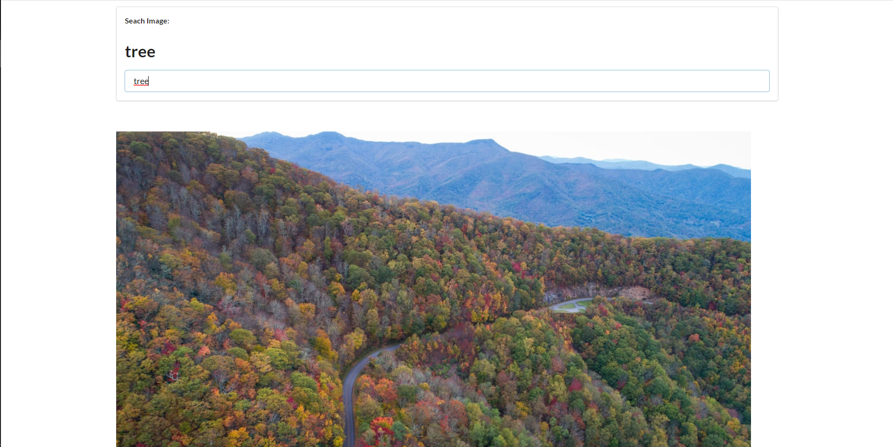

# Search Application Website
> This is an simple website using ReactJS, Javascript and calling API to receive data. Allow search picture from keyword you type.

## Built With

- Javascript
- Frameworks: ReactJS
- Technologies used: Calling API

## Live Demo

[Live Demo Link](https://react-search-image.herokuapp.com/)

## Getting Started

**This is an example of how you may give instructions on setting up your project locally.**

To get a local copy up and running follow these simple example steps.

### Setup
`npm install`

### Install
`npm start`

### Run tests
`yarn test`

### Deployment
The build is minified and the filenames include the hashes.\
Your app is ready to be deployed!

See the section about [deployment](https://facebook.github.io/create-react-app/docs/deployment) for more information.

### `yarn eject`

**Note: this is a one-way operation. Once you `eject`, you can’t go back!**

If you aren’t satisfied with the build tool and configuration choices, you can `eject` at any time. This command will remove the single build dependency from your project.

## Authors

👤 **Author1**

- GitHub: [@github](https://github.com/2dtrung)
- Twitter: [@twitter](https://twitter.com/2dtrung)
- LinkedIn: [LinkedIn](https://linkedin.com/in/2dtrung)

## 🤝 Contributing

Contributions, issues, and feature requests are welcome!

Feel free to check the [issues page](../../issues/).

## Acknowledgments

- Hat tip to anyone whose code was used
- Inspiration
- etc

## 📝 License

This project is [MIT](./MIT.md) licensed.
